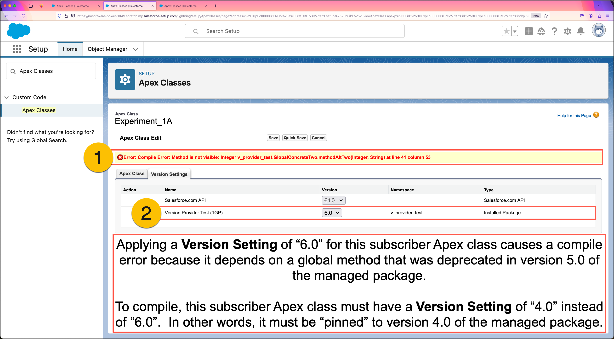

# Experiment One: Subscriber Apex Depending on 1GP

This experiment demonstrates how Salesforce’s “Package Versions” feature affects subscriber Apex in first-generation managed packages (1GP). 

When subscriber Apex interacts with global classes from a managed package, the **Version Settings** determine which package version the code is "pinned" to. This helps ensure that subscriber code can maintain expected behavior after package upgrades and gives publishers the option to implement version-specific behavior when demanded by their customers.

In this experiment, you'll see how introducing `@Deprecated` methods via package upgrades can impact compilation of subscriber metadata. You'll see how subscriber classes leverage **Version Settings** to "pin to" global Apex in a specific package version. By the end, you'll have context that will help you understand the gaps that have existed in 2GP, prior to the inclusion of **Version Settings** support in the Winter '25 release.

## Objectives

* Learn how **Package Version** settings impact subscriber Apex with managed 1GP dependencies.
* Observe how **Package Version** settings can prevent compile errors with subscriber Apex.
* Observe that behavior of packaged Apex is always driven by the most recent implementation, regardless of **Package Version** settings.

## Step-by-Step Overview

1. Initialize a 1GP subscriber org and directly install package `ver 4.0 (1GP)`.
2. Deploy subscriber Apex that depends on `global` Apex from package `ver 4.0 (1GP)`.
3. Execute anonymous Apex to see what the packaged Apex is doing in `ver 4.0 (1GP)`.
4. Upgrade directly from `ver 4.0 (1GP)` to `ver 6.0 (1GP)`, introducing `@Deprecated` Apex to the org.
5. Attempt to redeploy subscriber Apex and observe compilation errors.
6. Retrieve previously deployed subscriber Apex and observe changes to `.cls-meta.xml` files.
7. Attempt to redeploy subscriber Apex again and observe success this time.

## Detailed Instructions

#### 1. Initialize a 1GP subscriber org and directly install package `ver 4.0 (1GP)`.
```
./initSubscriber --1GP --first-version 4 --last-version 4
```

---

#### 2. Deploy `Experiment_1*` subscriber classes.
```
sf project deploy start -m "ApexClass:Experiment_1*" --ignore-conflicts
```

---

#### 3. Execute `Experiment_1.apex` showing only `USER_DEBUG` log lines.
```
sf apex run --file scripts/apex/Experiment_1.apex | grep USER_DEBUG
```


---

#### 4. Upgrade to the installed package directly to `ver 6.0 (1GP)`.
```
./upgradeSubscriber --1GP --first-version 6 --last-version 6
```

---

#### 5. Redeploy `Experiment_1*` subscriber classes, noting that all classes will fail to deploy.
```
sf project deploy start -m "ApexClass:Experiment_1*" --ignore-conflicts
```


---

#### 6A. View the Class Summary for `v_provider_test__GlobalConcreteTwo` in Setup.
Open the `v_provider_test__GlobalConcreteTwo` class in Setup and note the following.
1. The class `v_provider_test__GlobalConcreteTwo` was installed as part of the `Version Provider Test (1GP)` package.
2. Selecting the **All Versions** filter shows ALL of the methods in this class and opens the **Available in Versions** panel.
3. Observe that the **Available in Versions** panel shows that `methodAltTwo(Integer, String)` is currently `@Deprecated`.
   * The UI shows that this method is only available in versions `3.0` through `4.0`.


---

#### 6B. Edit the Version Settings for `Experiment_1A` in Setup.
Return to the list of all **Apex Classes** in Setup.
1. Open the `Experiment_1A` class, click the **Edit** button, then open the **Version Settings** tab.
2. Note the row for the `Version Provider Test (1GP)` managed package that's installed in the org.
3. Note the `Experiment_1A` class can be "Pinned" to any package version between the first one installed (`4.0`) and the last one installed (`6.0`).
   * In the org, each subscriber class was automatically pinned to the version it was installed in.
   * Our local source files didn't have **Version Settings** information. That's why the last deployment attempt failed.
   * In a subsequent step, you'll retrieve the Apex classes from the org and your local source will become deployable again.


---

#### 6C. Attempt to "Pin" `Experiment_1A` to version `6.0` in Setup.
While still in Edit mode with `Experiment_1A`, attempt the following.
1. Change the Version for `Version Provider Test (1GP)` to `6.0`, then click the **Quick Save** button.
2. Observe the Compile Error, indicating dependence on a global method that's no longer visible.
   * Click **Cancel** to exit once you've completed your observations.



---

#### 7. Retrieve `Experiment_1*` classes from the org. Use the **Source Control** panel to inspect changes to the `.cls-meta.xml` for each subscriber class.
```
sf project retrieve start -m "ApexClass:Experiment_1*" --ignore-conflicts
```

---

#### 8. Attempt to redeploy the `Experiment_1*` subscriber classes. Note success because the `.cls-meta.xml` files contain `<packageVersions>` information that "pins" each subscriber class to a specific managed package version.
```
sf project deploy start -m "ApexClass:Experiment_1*" --ignore-conflicts
```

---

## Key Takeaways
* Applying **Version Settings** to a subscriber class impacts the compilation of the subscriber class.
* The logic executed by packaged Apex is always implemented by the most recent version.
  * This can be observed by examining the changes in debug output between `ver 4.0 (1GP)` and `ver 6.0 (1GP)`.
* Publishers wishing to preserve logic that provides backward-compatible output to subscribers must implement multiple code paths in their most recent package version.
  * Publishers can do this by using the [Version Class](https://developer.salesforce.com/docs/atlas.en-us.apexref.meta/apexref/apex_methods_system_version.htm) and the `System.requestVersion` method.
  * For additional context, see [Versioning Apex Code Behavior](https://developer.salesforce.com/docs/atlas.en-us.apexcode.meta/apexcode/apex_manpkgs_behavior.htm) in the Apex Developer Guide.