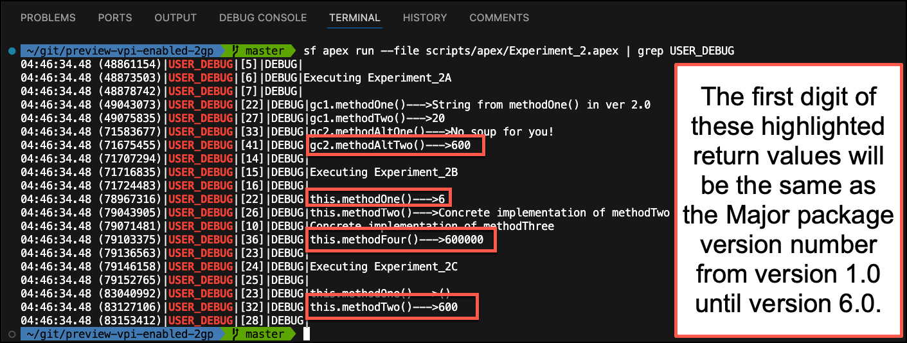
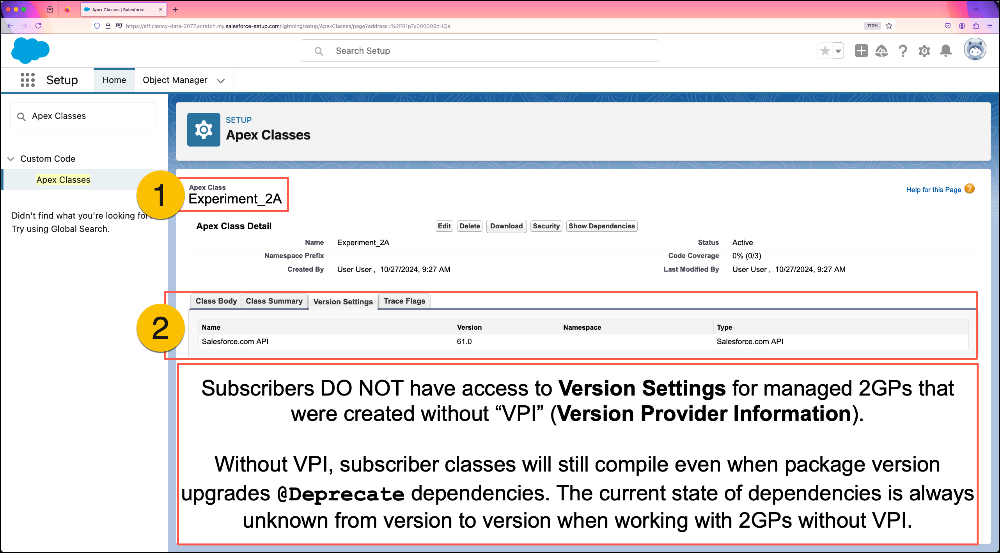

# Experiment Two: Subscriber Apex Depending on 2GP Without "Version Settings" Support

This experiment demonstrates subscriber Apex interacting with global classes in a package version without **Version Settings** support.

Managed 2GPs without **Version Settings** support have the following limitations:

1. Subscriber Apex classes and Visualforce components cannot be "pinned" to a specific version of the 2GP.
2. Package versions that introduce `@Deprecated` Apex have no impact on the compilation of subscriber metadata.
   * This allows subscribers to build integrations with packaged Apex that publishers have no intention of supporting.
3. Packaged Apex classes can not use the `System.requestVersion()` method.

## Objectives of this Experiment

* Learn about the subscriber impact of installing 2GPs that lack **Version Provider Information**.
* Observe how the **Class Summary** for a 2GP managed-global Apex class differs from the 1GP example in [Experiment One](/EXPERIMENT_1.md).
* Observe how **Package Version** settings for subscriber Apex are not available for installed 2GPs that lack **Version Provider Information**.

## Step-by-Step Overview

1. Initialize a 2GP subscriber org and directly install package `ver 6.0 (1GP)`.
2. Deploy subscriber Apex that depends on `@Deprecated` Apex from package `ver 6.0 (1GP)`.
3. Try to identify `@Deprecated` global Apex from the **Class Summary** page in Setup.
4. Execute anonymous Apex to see what the packaged Apex is doing in `ver 6.0 (1GP)`.
5. View the **Class Summary** for a subscriber Apex class and observe differences from the 1GP example in [Experiment One](/EXPERIMENT_1.md).

## Detailed Instructions

#### 1. Initialize a 2GP subscriber org and directly install package `ver 6.0 (2GP)`.
```
./initSubscriber --2GP --first-version 6 --last-version 6
```
**NOTE:** The following were `@Deprecated` in `ver 5.0 (2GP)`:
* The method `methodAltTwo(Integer, String)` inside the `v_provider_test__GlobalConcreteTwo` class.
* The entire `v_provider_test__GlobalAbstractOne` class.

---

#### 2. Deploy `Experiment_2*` subscriber classes.
```
sf project deploy start -m "ApexClass:Experiment_2*" --ignore-conflicts
```
**NOTE:** The `Experiment_2*` subscriber classes depend on packaged Apex that was `@Deprecated` in `ver 5.0 (2GP)`.
* In 1GP, this deployment would result in an Apex compile error.
* In 2GP without **Version Settings** support, ALL global packaged Apex is visible to the subscriber, even when `@Deprecated`.

---

#### 3. View the Class Summary for `v_provider_test__GlobalConcreteTwo` in Setup.
Open the `v_provider_test__GlobalConcreteTwo` class in Setup and note the following.
1. The class `v_provider_test__GlobalConcreteTwo` was installed as part of the `Version Provider Test (2GP)` package.
2. The class summary shows ALL of the methods in this class, including `methodAltTwo(Integer, String)` which was `@Deprecated` in `ver 5.0 (2GP)`.
3. The **"Available in Versions"** section is missing completely.


---

#### 4. Execute `Experiment_2.apex` showing only `USER_DEBUG` log lines.
```
sf apex run --file scripts/apex/Experiment_2.apex | grep USER_DEBUG
```
**NOTE:** The subscriber dependencies on `@Deprecated` Apex still execute.
* Just as with 1GP, packaged-global Apex is always implemented by logic in the most recently installed package version.



---

#### 5. View the Class Summary for `Experiment_2A` in Setup.
Navigate to the **Apex Classes** page in Setup, then do the following.
1. Open the `Experiment_2A` subscriber class.
2. Switch to the **"Version Settings"** tab and observe that the `Version Provider Test (2GP)` package does not appear.
   * This differs from the behavior observed in [Experiment One](/EXPERIMENT_1.md) when the subscriber depended on a 1GP instead of a 2GP.



---

## Key Takeaways
* Prior to adding **Version Settings** support to 2GP, ALL packaged Apex was visible to subscribers, even `@Deprecated` Apex.
* Subscribers had no way of knowing which parts of a Global Apex class a publisher had marked as `@Deprecated`.
* As with 1GP, the logic executed by packaged Apex is always implemented by the most recent version.
  * This was confirmed by observing debug output starting with the digit `6` because the implementation was inside `ver 6.0 (2GP)`.
* Prior to adding **Version Settings** support to 2GP, publishers were unable to add provides backward-compatible output to subscribers because the `System.requestVersion()` method was unavailable in 2GP.
