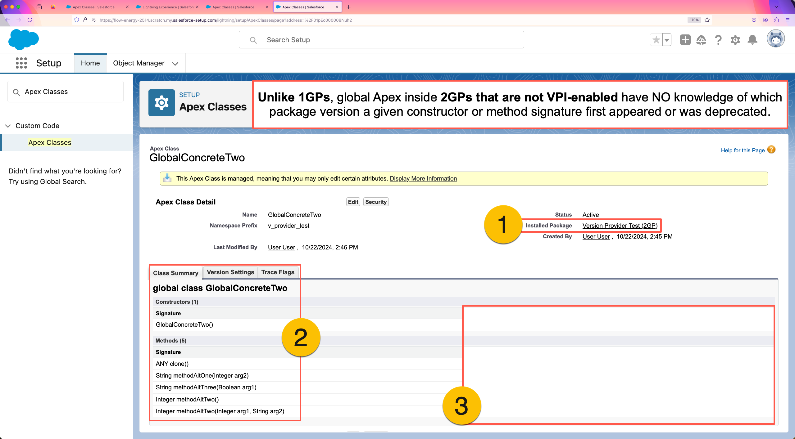
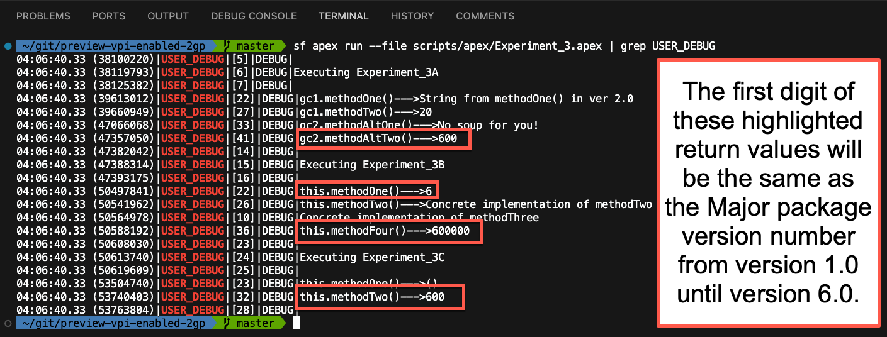
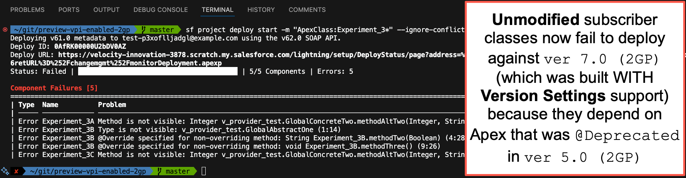
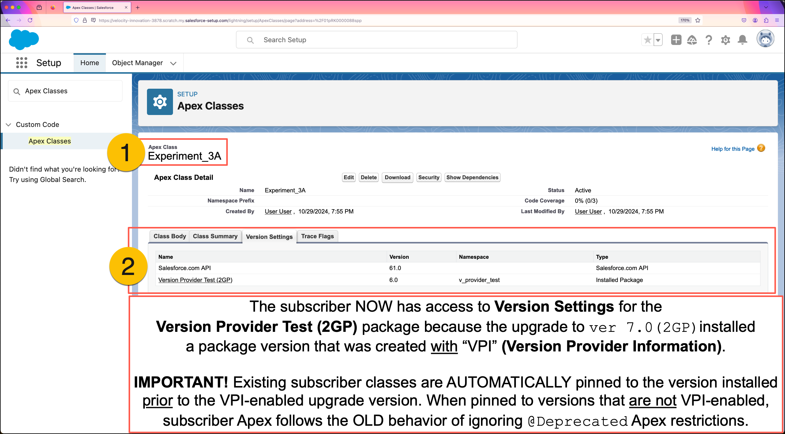

# Experiment Three: Subscriber Apex Depending on 2GP WITH "Version Settings" Support

This experiment demonstrates subscriber Apex interacting with global classes in a package version created WITH **Version Settings** support.

Managed 2GPs WITH **Version Settings** support have the following capabilities:

1. Subscriber Apex classes and Visualforce components CAN be "pinned" to a specific version of the 2GP.
2. Package versions that introduce `@Deprecated` dependencies WILL CAUSE compilation errors in subscriber Apex if the subscriber classes are not "pinned" to a version where the dependency was not `@Deprecated`.
3. Packaged Apex classes in 2GPs CAN USE the `System.requestVersion()` method now.

## Objectives of this Experiment

* Learn about the subscriber impact of installing 2GPs that HAVE **Version Provider Information**.
* Observe how the **Class Summary** for a 2GP managed-global Apex class NOW MATCHES the 1GP example in [Experiment One](/EXPERIMENT_1.md).
* Observe how **Package Version** settings for subscriber Apex ARE available for installed 2GPs that have **Version Provider Information**.

## Step-by-Step Overview

1. Initialize a 2GP subscriber org and directly install package `ver 6.0 (1GP)`.
2. Deploy subscriber Apex that depends on `@Deprecated` Apex from package `ver 6.0 (1GP)`.
3. Try to identify `@Deprecated` global Apex from the **Class Summary** page in Setup.
4. Execute anonymous Apex to see what the packaged Apex is doing in `ver 6.0 (1GP)`.
5. View the **Class Summary** for a subscriber Apex class and observe differences from the 1GP example in [Experiment One](/EXPERIMENT_1.md).

## Detailed Instructions

#### 1. Initialize a 2GP subscriber org, installing package versions `ver 1.0 (2GP)` through `ver 6.0 (2GP)`.
```
./initSubscriber --2GP --first-version 1 --last-version 6
```
**NOTE:** The following were `@Deprecated` in `ver 5.0 (2GP)`:
* The method `methodAltTwo(Integer, String)` inside the `v_provider_test__GlobalConcreteTwo` class.
* The entire `v_provider_test__GlobalAbstractOne` class.

---

#### 2. Deploy `Experiment_3*` subscriber classes.
```
sf project deploy start -m "ApexClass:Experiment_3*" --ignore-conflicts
```
**IMPORTANT!** If you have published a commercial 2GP app, the state of this subscriber org after deploying the `Experiment_3*` classes is similar the state of YOUR subscribers right before upgrading to a 2GP with **Version Settings** support.
* The `Experiment_3*` subscriber classes depend on packaged Apex that was `@Deprecated` in `ver 5.0 (2GP)`.
  * [EXPERIMENT ONE - Step 5](/EXPERIMENT_1.md#5-redeploy-experiment_1-subscriber-classes-noting-that-all-classes-will-fail-to-deploy) showed how in 1GP this deployment would have failed with a compile error.
* Because package versions `ver 1.0 (2GP)` through `ver 6.0 (2GP)` WERE NOT built with **Version Settings** support, ALL global packaged Apex is visible to the subscriber, even when `@Deprecated`.
  * The screenshot from [EXPERIMENT TWO - Step 3](/EXPERIMENT_2.md#3-view-the-class-summary-for-v_provider_test__globalconcretetwo-in-setup) (below) showed what the lack of **Version Settings** looks like in the org. 



---

#### 3. Execute `Experiment_3.apex` showing only `USER_DEBUG` log lines.
```
sf apex run --file scripts/apex/Experiment_3.apex | grep USER_DEBUG
```
**NOTE:** The subscriber dependencies on `@Deprecated` Apex still execute.
* Just as with 1GP, packaged-global Apex is always implemented by logic in the most recently installed package version.



---

#### 4. Upgrade the installed package directly to `ver 7.0 (2GP)`.
```
./upgradeSubscriber --2GP --first-version 7 --last-version 7
```
**NOTE:** Package version `ver 7.0 (2GP)` has the following characteristics.
* Package version `ver 7.0 (2GP)` was created WITH **Version Settings** support.
* In `ver 7.0 (2GP)` the method `methodAltTwo(Integer, String)` inside `v_provider_test__GlobalConcreteTwo` was modified to use the `System.requestVersion()` method to determine the package version the calling Apex is pinned to.
* When you run `Experiment_3.apex` again, output values from `methodAltTwo(Integer, String)` will match the version that the subscriber Apex is pinned to.

---

#### 5. Redeploy `Experiment_3*` subscriber classes, noting that all classes will fail to deploy.
```
sf project deploy start -m "ApexClass:Experiment_3*" --ignore-conflicts
```


---


#### 6A. View the Class Summary for `Experiment_3A` in Setup.
Navigate to the **Apex Classes** page in Setup, then do the following.
1. Open the `Experiment_3A` subscriber class.
2. Switch to the **"Version Settings"** tab and observe that the `Version Provider Test (2GP)` package NOW appears and that `Experiment_3A` is currently "pinned" to version `6.0`.
   * Note that ALL existing subscriber Apex was automatically pinned to version `6.0` of the `Version Provider Test (2GP)` package because that was the version installed in the subscriber org when the upgrade to `ver 7.0 (2GP)` happened.
   * Subscriber Apex "pinned" to 2GP package versions that DO NOT support **Version Settings** will have the old 2GP behavior of seeing all global Apex, including all `@Deprecated` Apex.




---

#### 3. View the Class Summary for `v_provider_test__GlobalConcreteTwo` in Setup.
Open the `v_provider_test__GlobalConcreteTwo` class in Setup and note the following.
1. The class `v_provider_test__GlobalConcreteTwo` was installed as part of the `Version Provider Test (2GP)` package.
2. The class summary shows ALL of the methods in this class, including `methodAltTwo(Integer, String)` which was `@Deprecated` in `ver 5.0 (2GP)`.
3. The **"Available in Versions"** section is missing completely.


---

## Key Takeaways
* Prior to adding **Version Settings** support to 2GP, ALL packaged Apex was visible to subscribers, even `@Deprecated` Apex.
* Subscribers had no way of knowing which parts of a Global Apex class a publisher had marked as `@Deprecated`.
* As with 1GP, the logic executed by packaged Apex is always implemented by the most recent version.
  * This was confirmed by observing debug output starting with the digit `6` because the implementation was inside `ver 6.0 (2GP)`.
* Prior to adding **Version Settings** support to 2GP, publishers were unable to add provides backward-compatible output to subscribers because the `System.requestVersion()` method was unavailable in 2GP.
