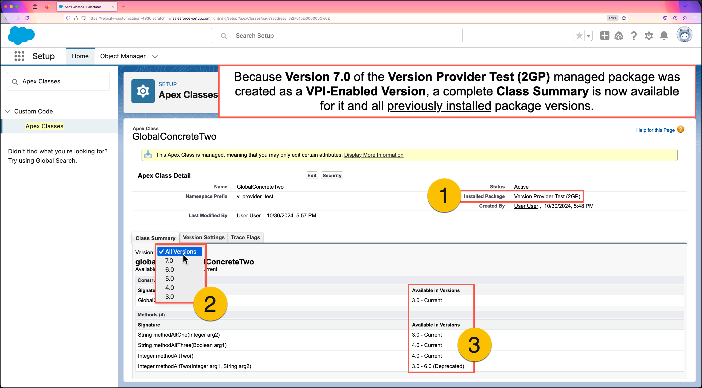
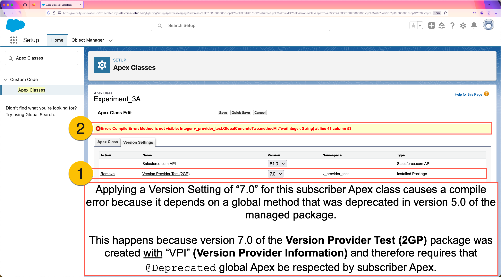
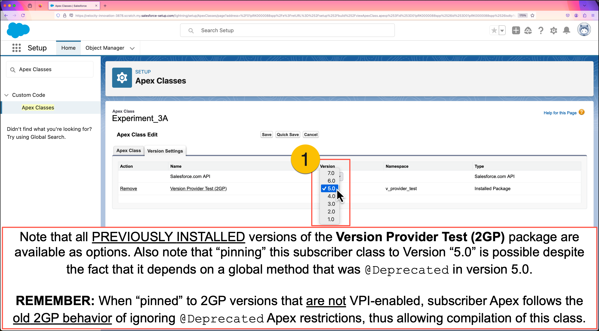
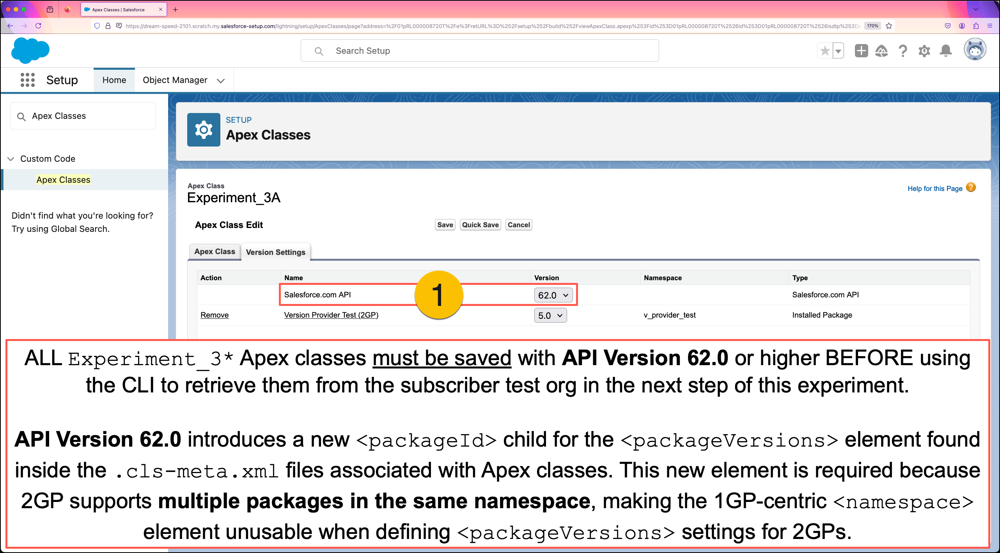
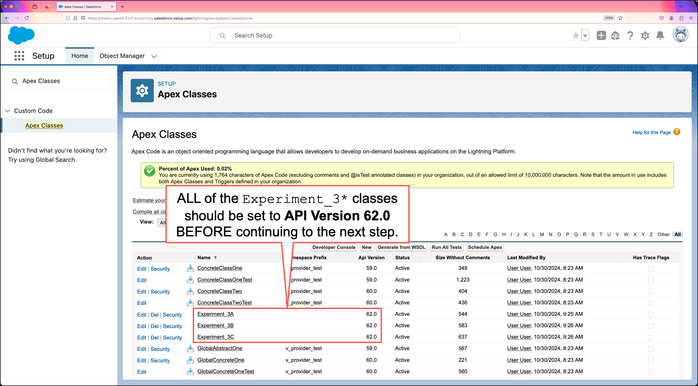
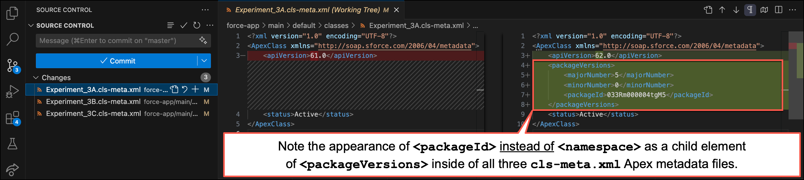
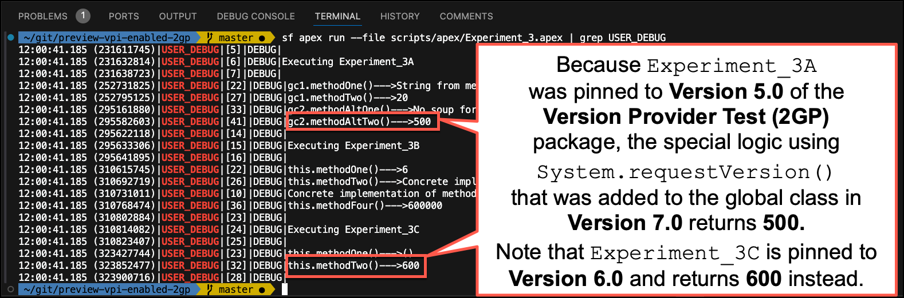

# Experiment Three: Subscriber Apex Depending on a 2GP WITH "Version Settings" Support

This experiment demonstrates subscriber Apex interacting with global classes in a package version created WITH **Version Settings** support.

Managed 2GPs WITH **Version Settings** support have the following capabilities:

1. Subscriber Apex classes and Visualforce components CAN be "pinned" to a specific version of the 2GP.
2. Package versions that introduce `@Deprecated` dependencies WILL CAUSE compilation errors in Subscriber Apex unless...
   * The Subscriber class is "pinned" to a version where the dependency was not `@Deprecated`.
   * The Subscriber class is "pinned" to an older package version created without **Version Settings** support.
3. Packaged Apex classes in 2GPs CAN USE the `System.requestVersion()` method now.

## Objectives of this Experiment

* Observe how Subscribers are impacted by **upgrading** to a 2GP version created with **Version Provider Information (VPI)**.
* Observe how the **Class Summary** for a `global` Apex class from a **VPI-Enabled 2GP version** NOW MATCHES the 1GP example in [EXPERIMENT ONE](/EXPERIMENT_1.md).
* Observe how the **Package Version** settings for Subscriber Apex ARE NOW available for **VPI-Enabled 2GP versions**.
* Observe how 2GP can now leverage `System.requestVersion()` to provide backward-compatible output from packaged `global` Apex.

## Step-by-Step Overview

1. Initialize a 2GP Subscriber org, installing package versions `ver 1.0 (2GP)` through `ver 6.0 (2GP)`.
2. Deploy Subscriber Apex that depends on packaged Apex that was `@Deprecated` in package `ver 5.0 (2GP)`.
3. Execute anonymous Apex, observing that Subscriber clases do not respect `@Deprecated` packaged Apex with 2GP.
4. Upgrade directly to `ver 7.0 (2GP)`, a **VPI-Enabled 2GP version**.
5. Attempt to redeploy Subscriber Apex and observe compilation errors.
6. View/modify **Version Settings** for Subscriber Apex using Setup UI.
7. Retrieve previously deployed subscriber Apex and observe changes to `.cls-meta.xml` files.
8. Attempt to redeploy subscriber Apex again and observe success this time.
9. Execute anonymous Apex again, observing how Subscriber Apex **Version Settings** impact behavior.

## Detailed Instructions

#### 1. Initialize a 2GP subscriber org, installing package versions `ver 1.0 (2GP)` through `ver 6.0 (2GP)`.
```
./initSubscriber --2GP --first-version 1 --last-version 6
```
**NOTE:** The following were `@Deprecated` in `ver 5.0 (2GP)`:
* The method `methodAltTwo(Integer, String)` inside the `v_provider_test__GlobalConcreteTwo` class.
* The entire `v_provider_test__GlobalAbstractOne` class.

---

#### 2. Deploy `Experiment_3*` subscriber classes.
```
sf project deploy start -m "ApexClass:Experiment_3*" --ignore-conflicts
```
**IMPORTANT!** If you have published a commercial 2GP app, the state of this subscriber org after deploying the `Experiment_3*` classes is similar the state of YOUR subscribers right before upgrading to a 2GP with **Version Settings** support.
* The `Experiment_3*` subscriber classes depend on packaged Apex that was `@Deprecated` in `ver 5.0 (2GP)`.
  * [EXPERIMENT ONE - Step 5](/EXPERIMENT_1.md#5-redeploy-experiment_1-subscriber-classes-noting-that-all-classes-will-fail-to-deploy) showed how in 1GP this deployment would have failed with a compile error.
* Because package versions `ver 1.0 (2GP)` through `ver 6.0 (2GP)` WERE NOT built with **Version Settings** support, ALL global packaged Apex is visible to the subscriber, even when `@Deprecated`.
  * The screenshot from [EXPERIMENT TWO - Step 3](/EXPERIMENT_2.md#3-view-the-class-summary-for-v_provider_test__globalconcretetwo-in-setup) (below) showed what the lack of **Version Settings** looks like in the org. 


---

#### 3. Execute `Experiment_3.apex` showing only `USER_DEBUG` log lines.
```
sf apex run --file scripts/apex/Experiment_3.apex | grep USER_DEBUG
```
**NOTE:** The subscriber dependencies on `@Deprecated` Apex still execute.
* Just as with 1GP, packaged-global Apex is always implemented by logic in the most recently installed package version.


---

#### 4. Upgrade the installed package directly to `ver 7.0 (2GP)`.
```
./upgradeSubscriber --2GP --first-version 7 --last-version 7
```
**NOTE:** Package version `ver 7.0 (2GP)` has the following characteristics.
* Package version `ver 7.0 (2GP)` was created WITH **Version Settings** support.
* In `ver 7.0 (2GP)` the method `methodAltTwo(Integer, String)` inside `v_provider_test__GlobalConcreteTwo` was modified to use the `System.requestVersion()` method to determine the package version the calling Apex is pinned to.
* When you run `Experiment_3.apex` again, output values from `methodAltTwo(Integer, String)` will match the version that the subscriber Apex is pinned to.

---

#### 5. Redeploy `Experiment_3*` subscriber classes, noting that all classes will fail to deploy.
```
sf project deploy start -m "ApexClass:Experiment_3*" --ignore-conflicts
```


---

#### 6A. View the Class Summary for `v_provider_test__GlobalConcreteTwo` in Setup.
Open the `v_provider_test__GlobalConcreteTwo` class in Setup and note the following.
1. The class `v_provider_test__GlobalConcreteTwo` was installed as part of the `Version Provider Test (2GP)` package.
2. Selecting the **All Versions** filter shows ALL of the methods in this class and opens the **Available in Versions** panel.
3. Observe that the **Available in Versions** panel shows that `methodAltTwo(Integer, String)` is currently `@Deprecated`.
   * This method was actually deprecated in `ver 5.0 (2GP)`.
   * Because that version was not **VPI-Enabled**, the method would still be visible if the Subscriber pins their class anywhere between versions `3.0` and `6.0`.
   * That's why the UI shows this method as **Available in Versions** `3.0 - 6.0 (Deprecated)`



---

#### 6B. View the Class Summary for `Experiment_3A` in Setup.
Return to the list of all **Apex Classes** in Setup.
1. Open the `Experiment_3A` subscriber class.
2. Switch to the **"Version Settings"** tab and observe that the `Version Provider Test (2GP)` package NOW appears and that `Experiment_3A` is currently "pinned" to version `6.0`.
   * Note that ALL existing subscriber Apex was automatically pinned to version `6.0` of the `Version Provider Test (2GP)` package because that was the version installed in the subscriber org when the upgrade to `ver 7.0 (2GP)` happened.
   * Subscriber Apex "pinned" to 2GP package versions that DO NOT support **Version Settings** will have the old 2GP behavior of seeing all global Apex, including all `@Deprecated` Apex.


---

#### 6C. Attempt to "Pin" `Experiment_3A` to version `7.0` in Setup.
While still on the `Experiment_3A` class, click the **Edit** button, then open the **Version Settings** tab.
1. Change the Version for `Version Provider Test (2GP)` to `7.0`, then click the **Quick Save** button.
2. Observe the Compile Error, indicating dependence on a global method that's no longer visible.



---

#### 6D. Attempt to "Pin" `Experiment_3A` to version `5.0` in Setup.
While still in **Edit** mode in the `Experiment_3A` class with the **Version Settings** tab open, do the following.
1. Change the Version for `Version Provider Test (2GP)` to `5.0`, then click the **Quick Save** button.
   * Observe there are NO Compile Errors, even though `Experiment_3A` depends on a global method that was `@Deprecated` in version `5.0`.
   * Observe that versions `1.0` through `7.0` of the `Version Provider Test (2GP)` package are available options for "pinning".
     * This is possible because you initialized this subscriber org using `./initSubscriber --2GP --first-version 1 --last-version 6` before updrading to `ver 7.0 (2GP)`.
     * If you had initialized this subscriber org with `--first-version 3` instead of `--first-version 1`, you'd only see versions `3.0` through `7.0` as **Version Settings** options.



---

#### 6E. Change the API Version of all `Experiment_3*` classes from `61.0` to `62.0`.
While still in **Edit** mode in the `Experiment_3A` class with the **Version Settings** tab open, do the following.
1. Change the Version for `Salesforce.com API` to `62.0`, then click the **Save** button.
   * **IMPORTANT!** Repeat this action **inside setup** for the `Experiment_3B` and `Experiment_3C` subscriber classes.
   * You MUST do this for all three `Experiment_3*` classes BEFORE moving to the next step in this experiment.
   * This ensures the new 2GP-specific Apex metadata child `<packageId>` will be retrieved in the next step.




---

#### 7. Retrieve `Experiment_3*` classes from the org, then use the **Source Control** panel to inspect changes to the `.cls-meta.xml` for each subscriber class.
```
sf project retrieve start -m "ApexClass:Experiment_3*" --ignore-conflicts
```
**NOTE:** Note the following after retrieving the `Experiment_3*` classes
* Each of the `.cls-meta.xml` files for the `Experiment_3*` classes was modified.
* Using the source compare view, you can see that `<packageVersions>` metadata is now present in your local source files.
  * This change will allow you to successfully re-deploy these classes.
* Note that when `<packageVersions>` metadata refers to a 2GP, it uses `<packageId>` to identify the package.
  * **IMPORTANT!** The new `<packageId>` element can only be used when the `<apiVersion>` is set to `62.0` or higher.
  * 2GP supports multiple packages with the same namespace, requiring more specificity than with 1GP.
  * This differs from what you saw in [EXPERIMENT ONE - Step 7](/EXPERIMENT_1.md#7-retrieve-experiment_1-classes-from-the-org-use-the-source-control-panel-to-inspect-changes-to-the-cls-metaxml-for-each-subscriber-class), where the `<packageVersions>` metadata used a `<namespace>` child element to refer to the **Version Provider Test (1GP)** package.



---

#### 8. Attempt to redeploy the `Experiment_3*` subscriber classes. Note success because the `.cls-meta.xml` files now contain `<packageVersions>` information that "pins" each subscriber class to version prior to `ver 7.0 (2GP)`.
```
sf project deploy start -m "ApexClass:Experiment_3*" --ignore-conflicts
```
**NOTE:** This deployment attempt should succeed without any compile errors.

---

#### 9. Execute `Experiment_3.apex` again, showing only `USER_DEBUG` log lines.
```
sf apex run --file scripts/apex/Experiment_3.apex | grep USER_DEBUG
```
**NOTE:** This experiment demonstrates how **Subscriber Apex Version Settings** can be used to deliver different behavior with 2GP.
* The `Experiment_3A` subscriber class is pinned to version `5.0` of the `Version Provider Test (2GP)` package.
* The `Experiment_3C` subscriber class is pinned to version `6.0` of the same package.
* The installed version of the `Version Provider Test (2GP)` package is currently `7.0`. 
  * This version introduced logic that uses `System.requestVersion()` to change the output of the global `methodAltTwo(Integer, String)` inside of the global `v_provider_test__GlobalConcreteTwo` class.
  * Observe how `Experiment_3A` returns `500` because you explicitly "pinned" this subscriber class to version `5.0` of the 2GP.
  * Observe how `Experiment_3C` returns `600` because it was automatically "pinned" to version `6.0` when you upgraded the package installed in this org to `ver 7.0 (2GP)`.
* This shows that 2GP developers can now satisfy subscribers requiring backward-compatible output for packaged `global` Apex that evolves over time, including being marked as `@Deprecated`.



---

## Conclusions / Key Takeaways
* Managed second-generation package versions (i.e., "2GP versions") created with **Version Provider Information (VPI)** support the use of **Version Settings** in Subscriber orgs once that **VPI-Enabled 2GP version** is installed.
  * During the developer preview period, a special DevHub perm and a modified `package version create` process are required to build **VPI-Enabled 2GP versions**.
  * Once this feature is Generally Available, **EVERY** new 2GP version will be created with **VPI-Enabled**.
  * Once GA, this change will apply to all 2GPs, will not require opt-in or configuration changes, and can not be opted-out of.
* When **upgrading** a Subscriber to a **VPI-Enabled package version**...
  * Subscriber Apex classes with existing dependencies are automatically "pinned" to the highest version number prior to the upgraded package version.
* When **installing** a **VPI-Enabled** package version into a new Subscriber...
  * Subscriber Apex classes will have the option to "pin" to any installed versions.
  * Classes not explicitly "pinned" to a specific version are compiled against the highest installed version (same as with 1GP).
* When "pinned" to 2GP versions that **ARE NOT VPI-Enabled**...
  * ALL `global` Apex added to the package BEFORE the **VPI-Enabled** version is visible to the Subscriber.
  * Subscribers can build dependencies on ANY `global` Apex in the package, including `@Deprecated` Apex.
* When "pinned" to 2GP versions that **ARE VPI-Enabled**...
  * Packaged `global` Apex marked as `@Deprecated` is properly hidden from Subscriber Apex.
  * Subscribers can not compile classes with dependencies on `@Deprecated` Apex from **VPI-Enabled** package versions.
* For both 1GP and 2GP, the logic executed by packaged Apex is always implemented by the most recent package version.
  * Publishers can leverage `System.requestVersion()` to create custom implementations that simulate prior versions IF the Publisher expects Subscribers to require backward-compatibility.

## Next Steps

Congratulations! After completing these experiments you should have a hands-on understanding of how Subscribers use **Version Settings** to interact with managed 1GPs and 2GPs.

Here are some ideas for additional experiments you can run on your own.

* Initialize a subscriber org with a **VPI-Enabled 2GP version** as the `--first-version`.
* View the [1GP and 2GP source](/package-source/) for the managed packages used in the experiments you ran.

### Want to try this with your 2GP? Join the 2GP Version Settings developer preview!

* Complete this [Developer Preview Participation Request Form](https://forms.gle/JfyxaQsFZarxfYAw8) to apply.

## Thank You!

Thanks for taking the time to learn about this important Apex and Packaging functionality.

If you found value in these exercises, please share this repo with your colleagues.